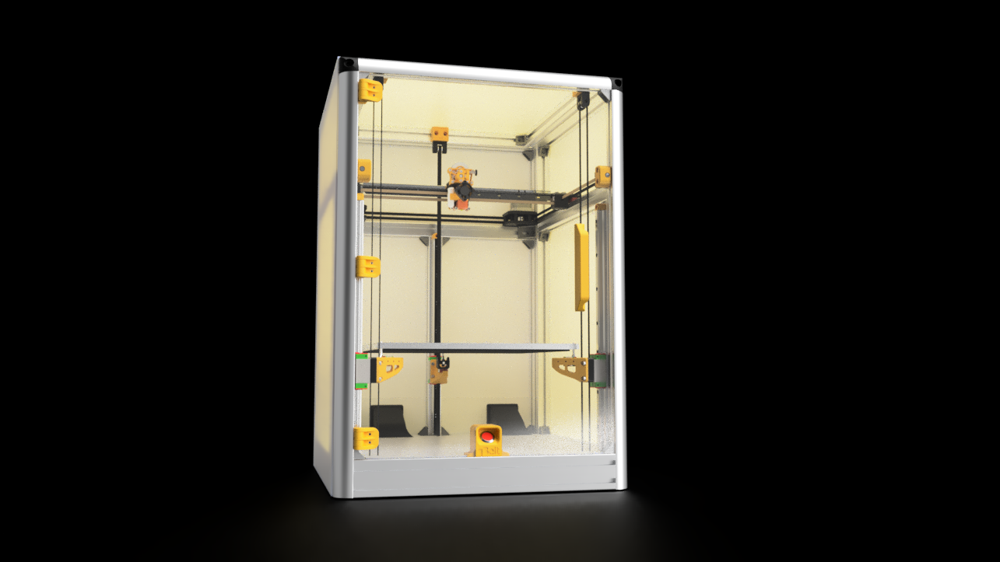

# qBelt The faster 3D Printer (Work In Progress)

The project is in the final stages of testing ... stay tuned for its release

# Fundamental Features

The project we now call qBelt, was born in 2020 for the purpose of spending time during the Covid-19 pandemic. 
Up to now, the project has come to life thanks to the advice of friends who have helped me to make it available to everyone with maximum performance in terms of quality and speed.

qBelt with simple 1.7A Nema17 motors was able to exceed 500mm / s at 80k acceleration. 
The tests continue to access the 48v power supply solution so as to go even faster.

With the configuration of the bridge in Carbon fiber Shape you get an overall weight of the gantry of just 550g (including the equipped mount and MGN9 guides)

The movement of the Z axis is composed of 3 motors that act separately from each other through the belts, 

this guarantees speed and quality thanks to the fact that there are no trapezoidal screws and ball-screws that can cause woobling problems or non-linear movements for a bad assembly. 

Furthermore, it is possible to access the self-calibration of the motors and self-leveling of the BED thanks to a probe placed on the mount, so as to always have the BED level.

# BOM - Parts list

## Structure

| Part  |      Description      | Quantity | Link/File | 
| :---         |     :---:      |     :---:     |  :---: |
| Frame   | Size          | 0             |  Link  |
| Base    | Size           | 0             |  Link  |

## Gantry - Carbon Shape

| Part  |      Description      | Quantity | Link/File | 
| :---         |     :---:      |     :---:     |  :---: |
| Frame   | Size          | 0             |  Link  |
| Base    | Size           | 0             |  Link  |

#### Mount

| Part  |      Description      | Quantity | Link/File | 
| :---         |     :---:      |     :---:     |  :---: |
| Frame   | Size          | 0             |  Link  |
| Base    | Size           | 0             |  Link  |

## Gantry - Extrude 2020 or Carbon Fiber Tube 20mm

| Part  |      Description      | Quantity | Link/File | 
| :---         |     :---:      |     :---:     |  :---: |
| Frame   | Size          | 0             |  Link  |
| Base    | Size           | 0             |  Link  |

#### Mount 

| Part  |      Description      | Quantity | Link/File | 
| :---         |     :---:      |     :---:     |  :---: |
| Frame   | Size          | 0             |  Link  |
| Base    | Size           | 0             |  Link  |

## Elevator 

### Z1/2 Axis 

| Part  |      Description      | Quantity | Link/File | 
| :---         |     :---:      |     :---:     |  :---: |
| Frame   | Size          | 0             |  Link  |
| Base    | Size           | 0             |  Link  |

### Z3 Axis

| Part  |      Description      | Quantity | Link/File | 
| :---         |     :---:      |     :---:     |  :---: |
| Frame   | Size          | 0             |  Link  |
| Base    | Size           | 0             |  Link  |

## Electronics

| Part  |      Description      | Quantity | Link/File | 
| :---         |     :---:      |     :---:     |  :---: |
| Frame   | Size          | 0             |  Link  |
| Base    | Size           | 0             |  Link  |

# Assembly Guide

# Social

- [Instagram](https://www.instagram.com/faq_t0tum/)
- [Discord](https://discord.gg/3S2ZAGSf)
- [YouTube](https://www.youtube.com/channel/UCHJ_528ZI0BcSU-QA8kIJlg)
- [PusaPrinter](https://www.prusaprinters.org/social/218145-faqtotum/about)

# License 
### [Attribution-NonCommercial-ShareAlike 4.0 International](http://creativecommons.org/licenses/by-nc-sa/4.0/)
 

You are free to:
- Share — copy and redistribute the material in any medium or format
- Adapt — remix, transform, and build upon the material

Under the following terms:
- Attribution — You must give appropriate credit, provide a link to the license, and indicate if changes were made. You may do so in any reasonable manner, but not in any way that suggests the licensor endorses you or your use.
- NonCommercial — You may not use the material for commercial purposes.
- ShareAlike — If you remix, transform, or build upon the material, you must distribute your contributions under the same license as the original.
